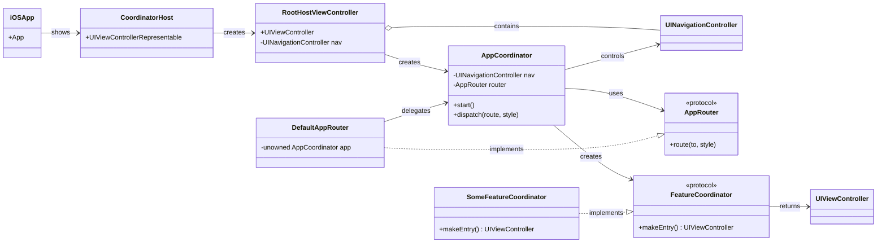

# 概要
このアプリはポイント獲得や利用をするもので、Kotlin MultiPlatform(KMP)を利用しています。KMPを使用し、AndroidとiOSのビジネスロジックやデータレイヤーをどのように共通化できるか検証するためのアプリです。

# 画面フローのスクリーンショット
  

# 雑多メモ
AIコーディング支援ツールでKMPをどこまで実装できるのか検証します。
MemoryBank機能を使います。最初はデフォルトのままで試しましたが読み込むファイル数が無駄に多く使われないものもあったので極限まで減らし、`Custom Instruction`ではなくルールファイルで指示するようにしました。

# iOSの設計
iOS は「SwiftUI と UIKit を橋渡ししつつ、ナビゲーションは UIKit の `UINavigationController` に一元化」する方針です。iOS16+サポートは多くの業務アプリがまた条件を満たしていないと思うので、SwiftUI の `NavigationStack` は使用しません。
以下は、各クラスのドキュメンテーションコメントを読み始める前に把握しておくべき設計の全体像です。

## 全体像（流れ）
- エントリは SwiftUI の `App` から始まり、`WindowGroup` で UIKit ホストを表示します。
- ホストは SwiftUI と UIKit を繋ぐブリッジで、ルートとなる UIKit コンテナを返します。
- Rootコンテナはアプリで唯一の `UINavigationController` を子に持ち、アプリ内のすべての画面遷移をこのスタックに集約します。
- 画面遷移の統括はCoordinatorが担い、機能単位のエントリ組み立ては各 Feature のCoordinatorに委譲されます。

## 設計俯瞰
以下は、具体的な列挙値や画面名に依存しない、クラス間の関係を示す高レベルの図です。

## 責務分割（役割）
- Rootコンテナ: 単一のナビゲーションスタックを保持し、見た目や配置（全画面制約）、ステータスバー背景の安定制御など UI コンテナとしての責務を負います。
- アプリ用Coordinator: 抽象的な「行き先」を受け取り、該当する Feature のエントリ画面を組み立てて遷移を実行します（push/root置換/modal）。
- Router（抽象）: Feature 側からの遷移依頼の窓口。Feature はこの抽象に依存し、具体的な遷移方法やスタック構造を知りません（DIP）。
- Feature Coordinator: 各機能の「最初に表示する画面」を構築して返します。以降の遷移はRouterに依頼します。

## ナビゲーション方針
- ナビゲーションは UIKit の `UINavigationController` に統一します。これにより、戻る制御やmodalとの組み合わせが明快になり、SwiftUI 側の状態同期の複雑さを回避できます。
- ルート置換／スタック push／modalといった表現は、アプリ用Coordinatorの一箇所に集約して扱います（DRY）。

## ステータスバー背景の安定制御
- SwiftUI と UIKit の混在環境ではステータスバー背景色が状況によりぶれやすいため、ルートコンテナが Window 直下にオーバーレイを敷いて背景を安定させます（レイアウトや回転、セーフエリア変化に追随）。

## 拡張の考え方
- 新しい機能を追加する際は、アプリ用Coordinatorに機能用Coordinatorの生成ロジックを関連付け、Feature 側はRouter抽象を通じて遷移を依頼します。
- 具体的な列挙値や画面名に依存せず、抽象的な「行き先」と「遷移方法」を介して拡張することで、既存コードへの影響を局所化します（OCP）。
- ルートコンテナは UI コンテナとして、アプリ用Coordinatorは遷移統括として、Feature Coordinatorは初期画面組み立てとして、それぞれ責務を限定。
- Feature はRouter（抽象）に依存し、具体的な遷移実装から切り離す。
- 遷移の実体はCoordinatorに集約し、必要十分な最小構成で保守性を重視。
