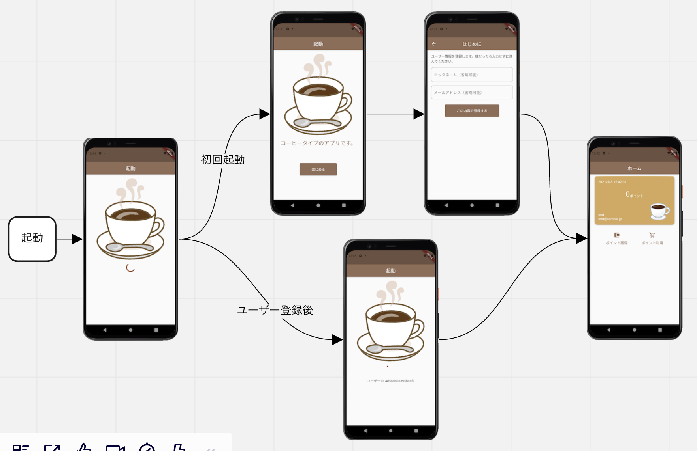
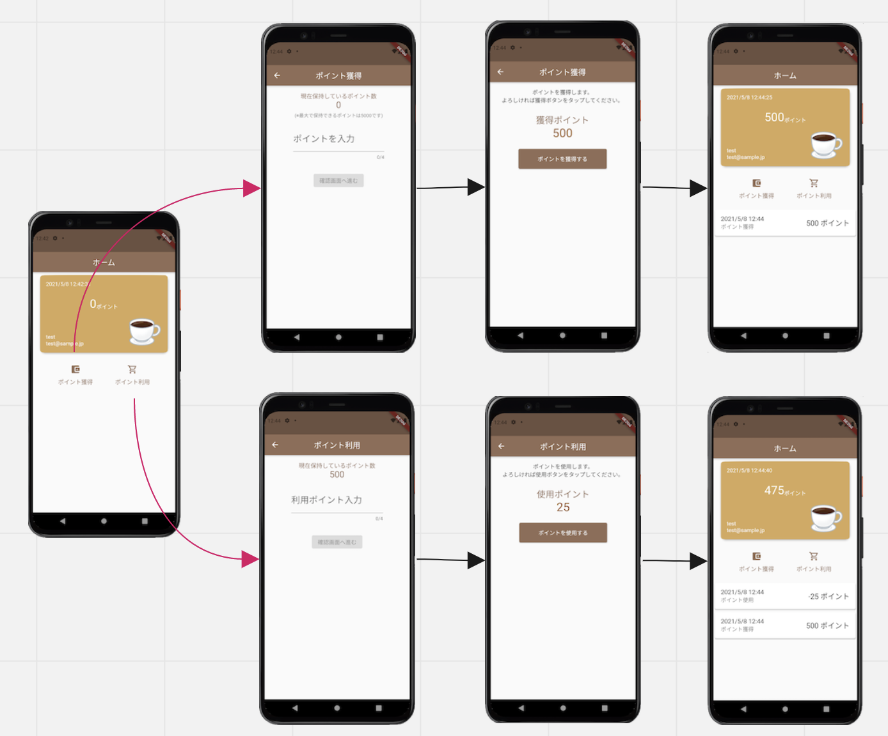

# 概要
このアプリはポイント獲得や利用をするもので、Kotlin MultiPlatform(KMP)を利用しています。KMPを使用し、AndroidとiOSのビジネスロジックやデータレイヤーをどのように共通化できるか検証するためのアプリです。

# 画面フローのスクリーンショット
  



# 雑多メモ
ClineやRoo CodeでKMPをどこまで実装できるのか検証します。
MemoryBank機能を使います。最初はデフォルトのままで試しましたが読み込むファイル数が無駄に多く使われないものもあったので極限まで減らし、`Custom Instruction`ではなくルールファイルで指示するようにしました。
できれば業務でそのまま使いたかったのですが、AndroidViewやStoryboardを実装してもらうのはおそらく不可能に近いので宣言的UIを使うことにしました。ただ、AndroidはAndroidViewも併用できるか検証するため両方使っています。
TODO iOSアプリ側

# 検証1
ホーム画面からの遷移およびポイント入力画面の実装をしてもらう。デフォルトのMemoryBankで実施。
実装計画は`gemini-2.5-pro`、実装は`gemini-2.5-flash`にやってもらった。
```
- タスク1つ目: $0.03
  - MemoryBankの内容に従ってタスクを1つずつ実行してください。
  - Tokens: 332.1k
  - →activeContext.mdを利用しろと指示。progress.mdいらなくないか？
- タスク2, 3: $0.0894
  - 勝手にactiveContextを修正してくれた。そのままタスク3に進める
  - Tokens: 1.4m
  - Cache: flashなのでなし
- ここまでで138円
  - エラーの解消
```
エラーが多すぎてかなり自分で修正したものの、叩き台としては悪くない。ただこれだと辛いのでもっと精査する。

# 検証2
ポイント獲得画面の実装をしてもらう。オレオレMemoryBank
実装計画も実装も`gemini-2.5-pro`にやってもらった。
```
- 実装計画(pro): $0.1167
  - Tokens: 192.7k
  - Cache: 110.4k
- 実装(pro): $1.45
  - Tokens: 2.1m
  - Chache: 1.4m
  - 良い点:
    - UseCaseの戻り値がエラーになっていたが、vscodeではエラーのままで良いという指示をしていたにもかかわらずこれは無視しないほうがいいといってくれた
  - 不満点:
    - 勝手に余計なコメントを入れたり、コードを書き換えられる。余計な差分が発生するので修正しないコードにコメント入れないこと
```
エラーは少なく、少し修正したらそれなりのものができた。やり取りする中で最初の実装計画が誤っていたりKMP側の実装が誤っている箇所があった。

次にやること
- PointUse機能を実装
