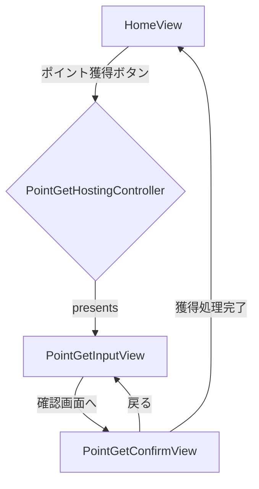

# iOS ポイント獲得機能 実装計画書

## 1. 概要
`design/nextTask.md`の要求に基づき、iOSアプリにポイント獲得機能を追加する。
本機能はAndroidアプリで実装済みの機能を参考に、SwiftUIを用いて実装する。

## 2. 実装方針
- **アーキテクチャ**: 既存の`HomeView`と同様に、MVVM (Model-View-ViewModel) アーキテクチャを採用する。
- **UI**: SwiftUI を使用し、「ポイント獲得入力画面」と「ポイント獲得確認画面」の2画面を実装する。
- **状態管理**: `ObservableObject`プロトコルに準拠した`PointGetViewModel`を作成し、UIの状態とビジネスロジックを管理する。
- **非同期処理**: KMP `shared`モジュールの`PointUseCase`を呼び出す際は、Swift Concurrency (`async/await`) を利用する。
- **画面遷移**: `HomeView`からポイント獲得画面へモーダルで遷移する。ポイント獲得画面内の遷移は`NavigationStack`で管理する。
- **文字列管理**: UIに表示するすべての文字列は`Localizable.strings`で管理する。Androidの`strings.xml`を正とし、プラットフォーム間で文言を統一する。
- **レイアウト**: **Android版のJetpack Compose実装を正とし、これを忠実に再現する。** 詳細は後述の「7. レイアウト参照仕様」を参照すること。

## 3. 画面遷移図

## 4. 作成・修正するファイル
### 4.1. 新規作成ファイル
| ファイル名                                       | 責務                                                                                                                                                           |
| ------------------------------------------------ | -------------------------------------------------------------------------------------------------------------------------------------------------------------- |
| `PointGetViewModel.swift`                        | - 現在のポイント残高の取得 - 入力された獲得ポイント数のバリデーション - ポイント獲得処理の実行 (`PointUseCase`の呼び出し) - UIの状態管理 (`@Published`) |
| `PointGetInputView.swift`                        | - ポイント獲得数を入力するUIの提供 - 現在のポイント残高の表示 - 入力値のバリデーション結果表示 - 確認画面への遷移トリガー                               |
| `PointGetConfirmView.swift`                      | - 入力された獲得ポイント数の確認表示 - ポイント獲得処理の実行トリガー - 処理中、成功、エラーの状態表示                                                       |
| `PointGetHostingController.swift`                | - SwiftUIのView(`PointGetInputView`をルートとする`NavigationStack`)をラップし、UIKitベースの画面遷移（モーダル表示）を可能にする。                               |

### 4.2. 修正対象ファイル
| ファイル名          | 修正内容                                           |
| ------------------- | -------------------------------------------------- |
| `HomeView.swift`    | 「ポイント獲得」ボタンのタップイベントに、`PointGetHostingController`をモーダルで表示する処理を実装する。 |

## 5. Localizable文字列の追加依頼
実装に着手する前に、**Androidの`strings.xml`と既存の`Localizable.xcstrings`を基に**、以下の文字列を`Localizable.strings`に追加していただく必要があります。

| Key                                       | Japanese (ja)                                          |
| ----------------------------------------- | ------------------------------------------------------ |
| `point_get_title`                         | ポイント獲得                                           |
| `point_get_input_overview`                | 現在保持しているポイント数                             |
| `point_get_input_attention %d`            | (※最大で保持できるポイントは%dです)                   |
| `point_get_input_text_field_label`        | ポイントを入力                                         |
| `point_get_input_confirm_button`          | 確認画面へ進む                                         |
| `point_get_confirm_overview`              | ポイントを獲得します！                                 |
| `point_get_confirm_detail`                | よろしければ「ポイントを獲得する」ボタンをタップしてください。 |
| `point_get_confirm_point_label`           | 獲得ポイント                                           |
| `point_get_confirm_execute_button`        | ポイントを獲得する                                     |
| `point_get_confirm_complete_dialog_message` | ポイントを獲得しました！                               |
| `point_get_confirm_error_dialog_title`    | エラー                                                 |
| `point_get_input_error_over_zero`         | 0より大きい値を入力してください。                      |
| `point_get_input_error_over_max`          | 最大で保持できるポイントを超えています。               |
| `common_dialog_ok`                        | OK                                                     |
| `common_dialog_title_success`             | 成功                                                   |
| `common_back_button_content_description`  | 戻る                                                   |

## 6. 実装タスクリスト
以下の順序で実装を進めます。

1.  **【ユーザー依頼】** `Localizable.strings`に上記リストの文字列を追加する。
2.  **【Roo】** `PointGetViewModel.swift`を実装する。
3.  **【Roo】** `PointGetInputView.swift`を実装する。
4.  **【Roo】** `PointGetConfirmView.swift`を実装する。
5.  **【Roo】** `PointGetHostingController.swift`を実装し、モーダル遷移を構成する。
6.  **【Roo】** `HomeView.swift`を修正し、ポイント獲得画面への遷移を実装する。

## 7. レイアウト参照仕様
SwiftUIでのレイアウト実装にあたっては、以下のAndroid側Compose実装ファイルを**唯一の正**とし、これと**全く同じレイアウト**になるように実装すること。Padding, Margin, Color, Font Size, Font Weightなど、すべてのスタイルは下記ファイルから読み取り、忠実に再現すること。

-   **`PointGetInputView.swift` の実装時:**
    -   参照ファイル: `androidApp/src/main/java/jp/hotdrop/considercline/android/ui/pointget/PointGetInputScreen.kt`

-   **`PointGetConfirmView.swift` の実装時:**
    -   参照ファイル: `androidApp/src/main/java/jp/hotdrop/considercline/android/ui/pointget/PointGetConfirmScreen.kt`