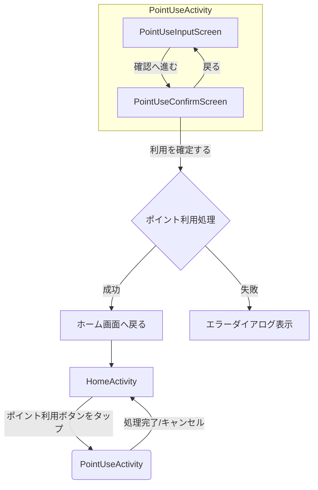

# ポイント利用機能 Android実装計画

## 1. 実装方針

既存のポイント獲得機能（`pointget`パッケージ）のアーキテクチャを踏襲し、ポイント利用機能（`pointuse`パッケージ）を実装します。UIはJetpack Compose、DIはHilt、画面遷移はNavigation Composeを使用します。ビジネスロジックは`shared`モジュールに実装済みの`PointUseCase`を利用します。

## 2. 作成・変更が必要なファイル一覧と責務

### `androidApp` モジュール
- パッケージ: `androidApp/src/main/java/jp/hotdrop/considercline/android/ui/`
- 新規作成
  - `pointuse/PointUseActivity.kt`: ポイント利用機能全体のコンテナ。`PointUseNavigationHost`をホストし、画面終了時の結果を`HomeActivity`に返す。
  - `pointuse/PointUseViewModel.kt`: UIロジックと状態管理を担当。`PointUseCase`を呼び出し、ポイント利用処理を実行。UIの状態（入力値、エラー、処理結果）を`StateFlow`で公開する。
  - `pointuse/PointUseNavigationHost.kt`: Jetpack Navigation Composeの`NavHost`を定義。`PointUseInputScreen`と`PointUseConfirmScreen`間の画面遷移を管理する
  - `pointuse/PointUseInputScreen.kt`: ポイント利用数を入力するUI。`TextField`と確認ボタンで構成される。`ViewModel`から受け取った状態に応じてUIを更新し、ユーザー入力を`ViewModel`に通知する。
  - `pointuse/PointUseConfirmScreen.kt`: 利用ポイント数を確認するUI。確定ボタンで構成される。ボタン押下で`ViewModel`にポイント利用を通知し、結果に応じてUI（ダイアログなど）を表示する。
- 変更
  - `home/HomeActivity.kt`: ポイント利用画面への遷移ボタンを追加します。

### `shared` モジュール
絶対にUseCaseに勝手に関数を追加してはいけません。既存の関数で全ての仕様を満たせます。`usecase/PointUseCase.kt`の`find()`と`use()`関数を利用してください。それ以外は利用してはいけません。

## 3. 画面間のナビゲーション設計

## 4. サブタスク
Orchestratorは、以下の単位でサブタスクを作成し、Codeモードに実装を依頼してください。
### 1. PointUseViewModelの作成
1. ステータス: 未実装
2. 内容
   1. `androidApp/src/main/java/jp/hotdrop/considercline/android/ui/pointuse/` パッケージを作成します。
   2. `originalFlutterSrc/point_use_view_model.dart`を参考に、`PointUseViewModel.kt`を作成します。
   3. `PointUseCase`のfind関数を使ってポイント残高の取得をします。入力値の保持とバリデーション、ポイント利用処理の実行ロジックをViewModelに実装します。
   4. 状態は個々に`StateFlow`を作るのではなく`data class`や`sealed class`でStateUIの状態（`UiState`）を定義します。
### 2. PointUseActivityの作成
1. ステータス: 未実装
2. 内容
   1. `PointUseActivity.kt`を作成し、`PointUseNavigationHost`を呼び出す基本的な枠組みを実装します。
### 3. PointUseInputScreenの作成
1. ステータス: 未実装
2. 内容
   1. `originalFlutterSrc/point_use_input_page.dart`を参考に、`PointUseInputScreen.kt`を作成します。
   2. ポイント残高の表示、利用ポイントの入力フィールド、確認画面への遷移ボタンを持つComposableを実装します。
   3. `ViewModel`と連携し、UIの状態を監視して表示を更新し、ユーザーのアクションを`ViewModel`に通知します。
### 4. PointUseConfirmScreenの作成
1. ステータス: 未実装
2. 内容
   1. `originalFlutterSrc/point_use_confirm_page.dart`を参考に、`PointUseConfirmScreen.kt`を作成します。
   2. 利用ポイントの確認表示、確定ボタン、入力画面へ戻るボタンを持つComposableを実装します。
   3. 確定ボタン押下で`ViewModel`のポイント利用処理を呼び出し、結果に応じてダイアログ表示や画面遷移を行います。
### 5. PointUseNavigationHostの作成とActivityへの統合
1. ステータス: 未実装
2. 内容
   1. `PointUseNavigationHost.kt` を作成します。
   2. `PointUseInputScreen`と`PointUseConfirmScreen`間のナビゲーションを定義します。
   3.  `PointUseActivity`に`PointUseNavigationHost`を組み込み、`ViewModel`のインスタンスを渡します。
### 6. HomeActivityへの導線追加
1. ステータス: 未実装
2. 内容
   1. `HomeActivity.kt` を変更します。
   2. ポイント利用画面 (`PointUseActivity`) を起動するためのボタンをUIに追加し、`ActivityResultLauncher` を使って画面遷移と結果の受け取りを実装します。